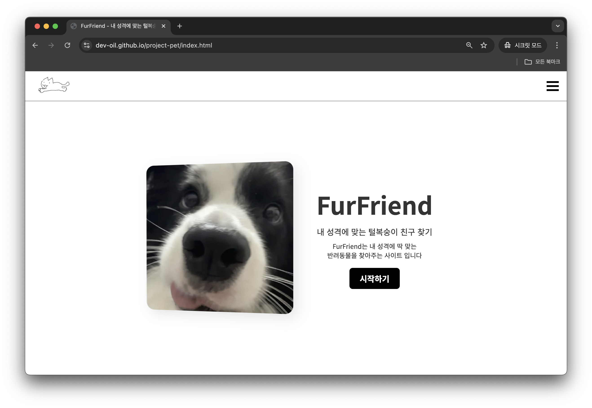

## 🐾 FurFriend - 당신과 맞는 유기동물을 찾아보세요!



### 🔗 프로젝트 링크

[FurFriend - 내 성격에 맞는 털복숭이 친구 찾기](https://dev-oil.github.io/project-pet/)

---

### 📖 프로젝트 개요

- FurFriend는 **펫BTI 테스트**를 통해 사용자의 성격과 어울리는 반려동물을 추천하는 웹사이트입니다.
- 또한, **경기도 유기동물 보호소 API**를 활용하여 실제 입양 가능한 유기동물 정보를 제공함으로써, "**사지 말고 입양하세요**"라는 메시지를 전달하고자 합니다.

#### 📆 개발 기간

- version1 (펫BTI 및 UI 구현)
  - 03/10 - 03/11

#### 👨‍💻 개발 인원

- **개인 프로젝트 (1인 개발)**

---

### ✨ 주요 기능

- ✅ **펫BTI 테스트**를 통한 맞춤 반려동물 추천
- ✅ **유기동물 보호소 API 연동**으로 실제 입양 가능한 동물 목록 제공
- ✅ **보호소 정보 제공** (이름, 위치, 연락처)
- ✅ **스크롤 애니메이션**을 활용한 부드러운 UI 경험 (AOS 라이브러리 사용)

---

### 🛠️ 기술 스택

#### 💻 프론트엔드

- **HTML, CSS, JavaScript, JSON**
- **AOS (Animate On Scroll) 라이브러리**

#### 🔧 개발 도구

- **Visual Studio Code**
- **Git & GitHub**

---

### 📂 프로젝트 구조

```bash
FurFriend/
│── images/         # 프로젝트에 사용된 이미지 파일
│── css/
│   ├── reset.css   # 기본 스타일 초기화
│   ├── style.css   # 전체적인 스타일
│── js/
│   ├── common.js   # 공통 스크립트
│   ├── mbti.js     # 테스트 기능 관련 스크립트
│   ├── result.js   # 테스트 결과 처리 스크립트
│── index.html      # 메인 페이지
│── about.html      # 프로젝트 소개 페이지
│── test.html       # 펫BTI 테스트 페이지
│── result.html     # 펫BTI 결과 페이지
│── shelters.html   # 보호소 정보 페이지
│── README.md       # 프로젝트 설명 파일
```

### 🚀 v2 업데이트 계획

- 📌 TypeScript 마이그레이션 (JS → TS 변환)
- 📌 API 연동 최적화 및 UI 개선
- 📌 반려동물 상세 정보 페이지 추가
- 📌 반려동물 검색 기능 추가
