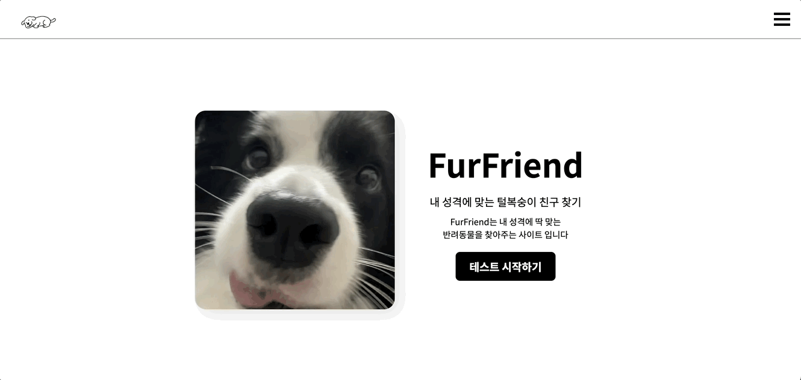
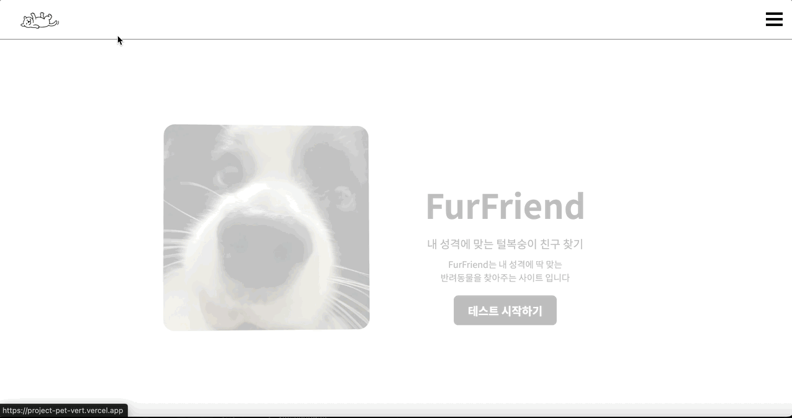

# 🐾 FurFriend - 당신과 어울리는 유기동물을 찾아보세요! 🐾

성격 유형을 기반으로 인연을 맺어줄 'FurFriend'를 만나보세요.

"사지 말고 입양하세요"라는 메시지를 담은 따뜻한 입양 추천 플랫폼입니다.



## 프로젝트 링크

[FurFriend - 내 성격에 맞는 털복숭이 친구 찾기](https://project-pet-vert.vercel.app/)

## 프로젝트 개요

- **FurFriend**는 MBTI 기반의 성격 테스트인 `펫BTI`를 통해 사용자와 잘 어울리는 반려동물을 추천하고, 실제로 입양 가능한 유기동물을 **경기도 보호소 API**를 통해 제공합니다.
- 단순한 추천을 넘어 **보호소 정보 및 입양 가능 정보**까지 연결하여, 직접 입양으로 이어질 수 있도록 돕습니다.

## 개발 기간

- **V1 [HTML + CSS 기본 기능 구현]:** 2025.03.10 ~ 2025.03.11 (맨손으로 집짓기)
- **V2 [React + TS 마이그레이션]:** 2025.04 ~ 05 (기술 적용)

## 개발 인원

- 1인 개인 프로젝트

## 주요 기능

| 구분             | 설명                                                |
| ---------------- | --------------------------------------------------- |
| 펫BTI 테스트     | 사용자 성격 유형 기반 반려동물 추천                 |
| 유기동물 추천    | 펫BTI 결과와 보호소 API 연계 추천                   |
| 보호소 정보 제공 | 이름, 주소, 연락처 정보 표시                        |
| 상세 페이지      | 추천 동물의 상세 정보 + 보호소 위치 (카카오맵 연동) |
| 필터 기능        | 지역/성별/중성화/유형 기반 검색 필터                |
| 반응형           | 모바일 대응 레이아웃 구성                           |

### petBTI test + 결과 내용 저장



- LocalStorage 이용을 위한 context, custom hook 사용

### 유기동물 정보 + 검색 및 필터링


- 검색 필터링, 페이지 계산 시 useMemo 이용

### 찜하기 기능


- LocalStorage 이용을 위한 context, custom hook 사용

### 유기동물 상세 + 보호소 정보


- Tanstack Query suspense, 경기도 유기동물 API + Kakao Map API

## 기술 스택

### Frontend

- React 19 + Vite
- TypeScript
- React Router
- TanStack Query (React Query)
- Tailwind CSS
- Framer Motion
- Lightbox
- Kakao Map API

### 개발 도구

- Visual Studio Code
- Git / GitHub
- Vercel (배포)

---

## 디렉토리 구조

```
FurFriend/
├── public/ # 정적 리소스
│ └── images/ # pet 이미지들 (petBTI 결과용)
├── src/
│ ├── components/ # 공통 컴포넌트
│ ├── contexts / # Context
│ ├── data / # petBTI 용 json
│ ├── hooks / # LocalStorage custom hook
│ ├── pages / # 홈, 소개, 테스트, 결과, 동물, 동물 상세 페이지
│ ├── services/ # API 호출 함수
│ ├── types/ # TypeScript 타입 정의
│ ├── utils/ # 카카오맵 유틸 함수
│ └── App.tsx
└── README.md
```

## 트러블슈팅 & 기술적 선택 이유

### 1. 정적 HTML → React로 마이그레이션

#### 문제점

| 문제                                             | 설명                                                                                                                                  |
| ------------------------------------------------ | ------------------------------------------------------------------------------------------------------------------------------------- |
| 정적 HTML 구조에서 상태 변화 및 UI 반영이 복잡함 | 최대한 모듈화를 위해 TypeScript 코드에서 `<h1>...</h1>` 같은 마크업을 직접 삽입해 UI를 구성했으나 기능이 늘어날수록 구조가 복잡해졌음 |
| 상태 변경 시 DOM 전체를 다시 렌더링하는 비효율   | 일부 요소만 바꿔도 전체를 다시 그리는 구조였음 (리액트가 필요했던 이유)                                                               |

#### 해결 방법

- React + TypeScript로 전환
- 컴포넌트 기반 구조 → 반복 UI 재사용 가능
- 상태 기반 렌더링 및 Virtual DOM → 변경된 부분만 효율적으로 업데이트

#### 결과

- 유지보수성과 확장성을 향상시켰음
- 사용자 사용 경험 개선

---

### 2. useEffect, Zustand → Context API + useLocalStorage

#### 문제점

| 문제                  | 설명                                                                                                  |
| --------------------- | ----------------------------------------------------------------------------------------------------- |
| Zustand 이슈          | TanStack Query나 React Router와 함께 사용할 시 상태 초기화 시점이 어긋나거나 리렌더링 누락이 발생했음 |
| 동일한 상태 공유 필요 | 펫BTI 결과와 찜하기 상태를 여러 컴포넌트에서 동일하게 유지해야 했음                                   |

#### 해결 방법

- `Context + useLocalStorage (custom hook)` 조합으로 상태 관리

  - `MbtiContext`: 펫BTI 결과
  - `FavoriteContext`: 찜하기 상태

- React 최상단에서 Provider로 감싸 전역 상태 제공
- 상태는 localStorage에 저장되어 새로고침, 직접 URL 접근 시에도 유지됨

#### 결과

- 모든 페이지에서 상태 접근이 가능해졌음
- 외부 접근, 새로고침에도 누락없이 안전하게 작동하게됨
- Tanstack Query 충돌 해결

---

### 3. URL 직접 접근 대응: `location.state` 보완

#### 문제점

| 문제                                              | 설명                                                                   |
| ------------------------------------------------- | ---------------------------------------------------------------------- |
| `location.state`는 브라우저 새로고침 시 undefined | MBTI 결과나 유기동물 상세 데이터를 state로만 전달하면 공유할 수 없었음 |

#### 해결 방법

- 결과 페이지(`/result`): `mbti`가 없으면 테스트 페이지로 리다이렉트
- 상세 페이지(`/animals/:id`): `state`가 없으면 `params.id`를 기반으로 데이터 탐색

#### 결과

- 사용자가 URL을 직접 입력해도 정상 동작
- 공유 가능한 SPA 완성

---

### 4. useMemo → 필터링/페이지네이션 최적화

#### 문제점

| 문제                                        | 설명                                                            |
| ------------------------------------------- | --------------------------------------------------------------- |
| 필터링/페이지네이션 로직 계산이 계속 실행됨 | `useEffect` 내 setFiltered 방식이 렌더링 흐름과 분리되어 있었음 |

#### 해결 방법

- `useMemo`로 조건 필터링 계산 및 페이지 계산감싸서 처리

#### 결과

- 불필요한 계산을 줄일 수 있었음
- 렌더링과 로직 분리로 가독성 향상

---

### 5. TanStack Query → 안정적인 데이터 요청 관리

#### 문제점

| 문제                                                    | 설명                                                                   |
| ------------------------------------------------------- | ---------------------------------------------------------------------- |
| `useEffect`를 통한 fetch는 로딩/에러/캐싱 처리가 반복됨 | 매 페이지마다 비슷한 로직을 중복 작성해야 하고, 상태 관리가 분산되었음 |
| 요청 시점, 재요청 조건 등을 직접 관리해야 함            | 새로고침, 재접속, 조건부 요청 등 다양한 경우에 대응하기 어려웠음       |

#### 해결 방법

- Tanstack 적용 `useQuery`, `useSuspenseQuery`를 사용해 비동기 fetch 로직을 추상화

  - 자동 캐싱, 리패칭, 조건부 요청(`enabled`) 등 내장 기능 제공

- `ResultPage`에서는 `enabled: !!pet` 조건으로 필요한 경우에만 요청
- 로딩/에러 UI는 `Suspense`, `ErrorBoundary`, `Skeleton` 컴포넌트로 통합 처리

#### 결과

- 데이터 요청 로직 일관화 → 매 페이지에서 재사용 가능
- 상태 관리(로딩, 에러, 성공)가 쉬워지고, 컴포넌트 구조가 단순해졌음
- 자동 캐싱으로 API 재요청 최소화 및 UX 향상
